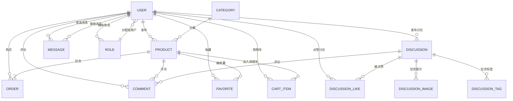

# 校园二手交易平台 - 数据库文档

## 1. 数据库概述

### 1.1 数据库名称

campus_second_hand

### 1.2 数据库版本

MySQL 8.0+

### 1.3 数据库字符集

UTF-8

### 1.4 数据库引擎

InnoDB

### 1.5 数据库用途

存储校园二手交易平台的所有业务数据，包括用户信息、商品信息、订单信息、社区讨论、评论、收藏等。

## 2. 数据库设计原则

1. **遵循三范式**：确保数据的完整性和一致性，减少数据冗余
2. **实体关系清晰**：明确各实体之间的关系，建立合理的外键约束
3. **性能优化**：合理设计索引，优化查询性能
4. **扩展性**：考虑未来业务发展，设计可扩展的数据库结构
5. **安全性**：敏感数据加密存储，设置合理的权限控制

## 3. 数据库实体关系图

### 3.1 Mermaid关系图

### 3.2 类图

### 3.3 实体关系图

## 4. 详细表结构

### 4.1 用户相关表

#### 4.1.1 users表

| 字段名 | 数据类型 | 约束 | 描述 |
|--------|----------|------|------|
| id | BIGINT | PRIMARY KEY, AUTO_INCREMENT | 用户ID |
| username | VARCHAR(50) | NOT NULL, UNIQUE | 用户名 |
| password | VARCHAR(255) | NOT NULL | 密码（加密存储） |
| email | VARCHAR(100) | NOT NULL, UNIQUE | 邮箱 |
| phone_number | VARCHAR(20) | | 手机号 |
| avatar_url | VARCHAR(255) | | 头像URL |
| real_name | VARCHAR(50) | | 真实姓名 |
| student_id | VARCHAR(20) | | 学号 |
| school_name | VARCHAR(100) | | 学校名称 |
| campus_name | VARCHAR(100) | | 校区名称 |
| is_active | BOOLEAN | DEFAULT TRUE | 是否激活 |
| created_at | DATETIME | NOT NULL, DEFAULT CURRENT_TIMESTAMP | 创建时间 |
| updated_at | DATETIME | DEFAULT CURRENT_TIMESTAMP ON UPDATE CURRENT_TIMESTAMP | 更新时间 |

#### 4.1.2 roles表

| 字段名 | 数据类型 | 约束 | 描述 |
|--------|----------|------|------|
| id | BIGINT | PRIMARY KEY, AUTO_INCREMENT | 角色ID |
| name | VARCHAR(50) | NOT NULL, UNIQUE | 角色名称（如ADMIN, USER） |
| description | VARCHAR(255) | | 角色描述 |

#### 4.1.3 user_roles表（用户角色关联表）

| 字段名 | 数据类型 | 约束 | 描述 |
|--------|----------|------|------|
| user_id | BIGINT | NOT NULL, FOREIGN KEY (user_id) REFERENCES users(id) | 用户ID |
| role_id | BIGINT | NOT NULL, FOREIGN KEY (role_id) REFERENCES roles(id) | 角色ID |
| PRIMARY KEY | | (user_id, role_id) | 联合主键 |

### 4.2 商品相关表

#### 4.2.1 categories表

| 字段名 | 数据类型 | 约束 | 描述 |
|--------|----------|------|------|
| id | BIGINT | PRIMARY KEY, AUTO_INCREMENT | 分类ID |
| name | VARCHAR(50) | NOT NULL | 分类名称 |
| description | TEXT | | 分类描述 |
| icon_url | VARCHAR(255) | | 分类图标URL |
| sort_order | INT | DEFAULT 0 | 排序顺序 |
| is_active | BOOLEAN | DEFAULT TRUE | 是否激活 |
| created_at | DATETIME | NOT NULL, DEFAULT CURRENT_TIMESTAMP | 创建时间 |
| updated_at | DATETIME | DEFAULT CURRENT_TIMESTAMP ON UPDATE CURRENT_TIMESTAMP | 更新时间 |

#### 4.2.2 products表

| 字段名 | 数据类型 | 约束 | 描述 |
|--------|----------|------|------|
| id | BIGINT | PRIMARY KEY, AUTO_INCREMENT | 商品ID |
| title | VARCHAR(100) | NOT NULL | 商品标题 |
| description | TEXT | | 商品描述 |
| price | DECIMAL(10,2) | NOT NULL | 商品价格 |
| original_price | DECIMAL(10,2) | | 商品原价 |
| image_urls | TEXT | | 商品图片URL（JSON格式存储多个图片） |
| category_id | BIGINT | NOT NULL, FOREIGN KEY (category_id) REFERENCES categories(id) | 分类ID |
| seller_id | BIGINT | NOT NULL, FOREIGN KEY (seller_id) REFERENCES users(id) | 卖家ID |
| status | VARCHAR(20) | NOT NULL, DEFAULT 'AVAILABLE' | 商品状态（AVAILABLE, SOLD, RESERVED, REMOVED） |
| view_count | INT | DEFAULT 0 | 浏览次数 |
| like_count | INT | DEFAULT 0 | 点赞次数 |
| is_negotiable | BOOLEAN | DEFAULT TRUE | 是否可议价 |
| is_new | BOOLEAN | DEFAULT FALSE | 是否全新 |
| delivery_method | VARCHAR(50) | | 配送方式 |
| location | VARCHAR(100) | | 交易地点 |
| contact_info | VARCHAR(255) | | 联系方式 |
| created_at | DATETIME | NOT NULL, DEFAULT CURRENT_TIMESTAMP | 创建时间 |
| updated_at | DATETIME | DEFAULT CURRENT_TIMESTAMP ON UPDATE CURRENT_TIMESTAMP | 更新时间 |

### 4.3 订单相关表

#### 4.3.1 orders表

| 字段名 | 数据类型 | 约束 | 描述 |
|--------|----------|------|------|
| id | BIGINT | PRIMARY KEY, AUTO_INCREMENT | 订单ID |
| order_number | VARCHAR(50) | NOT NULL, UNIQUE | 订单编号 |
| product_id | BIGINT | NOT NULL, FOREIGN KEY (product_id) REFERENCES products(id) | 商品ID |
| buyer_id | BIGINT | NOT NULL, FOREIGN KEY (buyer_id) REFERENCES users(id) | 买家ID |
| seller_id | BIGINT | NOT NULL, FOREIGN KEY (seller_id) REFERENCES users(id) | 卖家ID |
| price | DECIMAL(10,2) | NOT NULL | 商品价格 |
| final_price | DECIMAL(10,2) | | 最终成交价 |
| status | VARCHAR(20) | NOT NULL, DEFAULT 'PENDING' | 订单状态（PENDING, CONFIRMED, PAID, SHIPPED, COMPLETED, CANCELLED, REFUNDED） |
| contact_info | VARCHAR(255) | | 联系方式 |
| delivery_address | VARCHAR(255) | | 配送地址 |
| delivery_method | VARCHAR(50) | | 配送方式 |
| payment_method | VARCHAR(50) | | 支付方式 |
| payment_status | VARCHAR(20) | DEFAULT 'UNPAID' | 支付状态（UNPAID, PAID, REFUNDED） |
| remarks | TEXT | | 备注 |
| created_at | DATETIME | NOT NULL, DEFAULT CURRENT_TIMESTAMP | 创建时间 |
| updated_at | DATETIME | DEFAULT CURRENT_TIMESTAMP ON UPDATE CURRENT_TIMESTAMP | 更新时间 |

#### 4.3.2 cart_items表

| 字段名 | 数据类型 | 约束 | 描述 |
|--------|----------|------|------|
| id | BIGINT | PRIMARY KEY, AUTO_INCREMENT | 购物车项ID |
| user_id | BIGINT | NOT NULL, FOREIGN KEY (user_id) REFERENCES users(id) | 用户ID |
| product_id | BIGINT | NOT NULL, FOREIGN KEY (product_id) REFERENCES products(id) | 商品ID |
| quantity | INT | NOT NULL | 数量 |
| created_at | DATETIME | NOT NULL, DEFAULT CURRENT_TIMESTAMP | 创建时间 |
| updated_at | DATETIME | NOT NULL, DEFAULT CURRENT_TIMESTAMP ON UPDATE CURRENT_TIMESTAMP | 更新时间 |

### 4.4 社区相关表

#### 4.4.1 discussions表

| 字段名 | 数据类型 | 约束 | 描述 |
|--------|----------|------|------|
| id | BIGINT | PRIMARY KEY, AUTO_INCREMENT | 讨论ID |
| user_id | BIGINT | NOT NULL, FOREIGN KEY (user_id) REFERENCES users(id) | 用户ID |
| title | VARCHAR(100) | NOT NULL | 讨论标题 |
| content | TEXT | NOT NULL | 讨论内容 |
| like_count | INT | DEFAULT 0 | 点赞次数 |
| comment_count | INT | DEFAULT 0 | 评论次数 |
| view_count | INT | DEFAULT 0 | 浏览次数 |
| is_deleted | BOOLEAN | DEFAULT FALSE | 是否删除 |
| created_at | DATETIME | NOT NULL, DEFAULT CURRENT_TIMESTAMP | 创建时间 |
| updated_at | DATETIME | DEFAULT CURRENT_TIMESTAMP ON UPDATE CURRENT_TIMESTAMP | 更新时间 |

#### 4.4.2 discussion_images表（讨论图片表）

| 字段名 | 数据类型 | 约束 | 描述 |
|--------|----------|------|------|
| id | BIGINT | PRIMARY KEY, AUTO_INCREMENT | 图片ID |
| discussion_id | BIGINT | NOT NULL, FOREIGN KEY (discussion_id) REFERENCES discussions(id) | 讨论ID |
| image_url | VARCHAR(255) | NOT NULL | 图片URL |

#### 4.4.3 discussion_tags表（讨论标签表）

| 字段名 | 数据类型 | 约束 | 描述 |
|--------|----------|------|------|
| id | BIGINT | PRIMARY KEY, AUTO_INCREMENT | 标签ID |
| discussion_id | BIGINT | NOT NULL, FOREIGN KEY (discussion_id) REFERENCES discussions(id) | 讨论ID |
| tag | VARCHAR(50) | NOT NULL | 标签内容 |

#### 4.4.4 comments表

| 字段名 | 数据类型 | 约束 | 描述 |
|--------|----------|------|------|
| id | BIGINT | PRIMARY KEY, AUTO_INCREMENT | 评论ID |
| product_id | BIGINT | NULL, FOREIGN KEY (product_id) REFERENCES products(id) | 商品ID（可为空，用于商品评论） |
| discussion_id | BIGINT | NULL, FOREIGN KEY (discussion_id) REFERENCES discussions(id) | 讨论ID（可为空，用于讨论评论） |
| user_id | BIGINT | NOT NULL, FOREIGN KEY (user_id) REFERENCES users(id) | 用户ID |
| content | TEXT | NOT NULL | 评论内容 |
| rating | INT | | 评分（1-5，仅用于商品评论） |
| parent_id | BIGINT | NULL, FOREIGN KEY (parent_id) REFERENCES comments(id) | 父评论ID（用于回复功能） |
| is_deleted | BOOLEAN | DEFAULT FALSE | 是否删除 |
| created_at | DATETIME | NOT NULL, DEFAULT CURRENT_TIMESTAMP | 创建时间 |
| updated_at | DATETIME | DEFAULT CURRENT_TIMESTAMP ON UPDATE CURRENT_TIMESTAMP | 更新时间 |

#### 4.4.5 discussion_likes表（讨论点赞表）

| 字段名 | 数据类型 | 约束 | 描述 |
|--------|----------|------|------|
| id | BIGINT | PRIMARY KEY, AUTO_INCREMENT | 点赞ID |
| user_id | BIGINT | NOT NULL, FOREIGN KEY (user_id) REFERENCES users(id) | 用户ID |
| discussion_id | BIGINT | NOT NULL, FOREIGN KEY (discussion_id) REFERENCES discussions(id) | 讨论ID |
| created_at | DATETIME | NOT NULL, DEFAULT CURRENT_TIMESTAMP | 创建时间 |
| updated_at | DATETIME | DEFAULT CURRENT_TIMESTAMP ON UPDATE CURRENT_TIMESTAMP | 更新时间 |

### 4.5 收藏相关表

#### 4.5.1 favorites表

| 字段名 | 数据类型 | 约束 | 描述 |
|--------|----------|------|------|
| id | BIGINT | PRIMARY KEY, AUTO_INCREMENT | 收藏ID |
| user_id | BIGINT | NOT NULL, FOREIGN KEY (user_id) REFERENCES users(id) | 用户ID |
| product_id | BIGINT | NOT NULL, FOREIGN KEY (product_id) REFERENCES products(id) | 商品ID |
| created_at | DATETIME | NOT NULL, DEFAULT CURRENT_TIMESTAMP | 创建时间 |

### 4.6 消息相关表

#### 4.6.1 messages表

| 字段名 | 数据类型 | 约束 | 描述 |
|--------|----------|------|------|
| id | BIGINT | PRIMARY KEY, AUTO_INCREMENT | 消息ID |
| sender_id | BIGINT | NOT NULL, FOREIGN KEY (sender_id) REFERENCES users(id) | 发送者ID |
| receiver_id | BIGINT | NOT NULL, FOREIGN KEY (receiver_id) REFERENCES users(id) | 接收者ID |
| content | TEXT | NOT NULL | 消息内容 |
| is_read | BOOLEAN | DEFAULT FALSE | 是否已读 |
| type | VARCHAR(50) | DEFAULT 'NORMAL' | 消息类型 |
| reference_id | BIGINT | | 关联ID（如订单ID、商品ID） |
| created_at | DATETIME | NOT NULL, DEFAULT CURRENT_TIMESTAMP | 创建时间 |
| updated_at | DATETIME | DEFAULT CURRENT_TIMESTAMP ON UPDATE CURRENT_TIMESTAMP | 更新时间 |

### 4.7 其他表

#### 4.7.1 pickup_points表（取货点表）

| 字段名 | 数据类型 | 约束 | 描述 |
|--------|----------|------|------|
| id | BIGINT | PRIMARY KEY, AUTO_INCREMENT | 取货点ID |
| name | VARCHAR(50) | NOT NULL | 取货点名称 |
| address | VARCHAR(255) | NOT NULL | 取货点地址 |
| contact_info | VARCHAR(255) | | 联系方式 |
| opening_hours | VARCHAR(100) | | 营业时间 |
| is_active | BOOLEAN | DEFAULT TRUE | 是否激活 |
| created_at | DATETIME | NOT NULL, DEFAULT CURRENT_TIMESTAMP | 创建时间 |
| updated_at | DATETIME | DEFAULT CURRENT_TIMESTAMP ON UPDATE CURRENT_TIMESTAMP | 更新时间 |

#### 4.7.2 platform_params表（平台参数表）

| 字段名 | 数据类型 | 约束 | 描述 |
|--------|----------|------|------|
| id | BIGINT | PRIMARY KEY, AUTO_INCREMENT | 参数ID |
| param_key | VARCHAR(50) | NOT NULL, UNIQUE | 参数键 |
| param_value | TEXT | NOT NULL | 参数值 |
| description | VARCHAR(255) | | 参数描述 |
| updated_by | BIGINT | FOREIGN KEY (updated_by) REFERENCES users(id) | 更新者ID |
| created_at | DATETIME | NOT NULL, DEFAULT CURRENT_TIMESTAMP | 创建时间 |
| updated_at | DATETIME | DEFAULT CURRENT_TIMESTAMP ON UPDATE CURRENT_TIMESTAMP | 更新时间 |

#### 4.7.3 announcements表（公告表）

| 字段名 | 数据类型 | 约束 | 描述 |
|--------|----------|------|------|
| id | BIGINT | PRIMARY KEY, AUTO_INCREMENT | 公告ID |
| title | VARCHAR(100) | NOT NULL | 公告标题 |
| content | TEXT | NOT NULL | 公告内容 |
| is_active | BOOLEAN | DEFAULT TRUE | 是否激活 |
| created_by | BIGINT | FOREIGN KEY (created_by) REFERENCES users(id) | 创建者ID |
| created_at | DATETIME | NOT NULL, DEFAULT CURRENT_TIMESTAMP | 创建时间 |
| updated_at | DATETIME | DEFAULT CURRENT_TIMESTAMP ON UPDATE CURRENT_TIMESTAMP | 更新时间 |

## 5. 数据库索引设计

### 5.1 用户表索引

- PRIMARY KEY: id
- UNIQUE: username, email
- INDEX: is_active, created_at

### 5.2 商品表索引

- PRIMARY KEY: id
- FOREIGN KEY: category_id, seller_id
- INDEX: status, created_at, view_count, like_count
- INDEX: location, category_id

### 5.3 订单表索引

- PRIMARY KEY: id
- UNIQUE: order_number
- FOREIGN KEY: product_id, buyer_id, seller_id
- INDEX: status, created_at, payment_status

### 5.4 讨论表索引

- PRIMARY KEY: id
- FOREIGN KEY: user_id
- INDEX: created_at, like_count, comment_count, view_count

### 5.5 评论表索引

- PRIMARY KEY: id
- FOREIGN KEY: product_id, discussion_id, user_id, parent_id
- INDEX: created_at

## 6. 数据库优化建议

1. **定期清理无效数据**：定期清理已删除的讨论、评论等无效数据
2. **优化查询语句**：避免使用SELECT *，只查询需要的字段
3. **合理使用索引**：根据查询需求创建合适的索引，避免过度索引
4. **分表分库**：当数据量增大时，考虑对热门表进行分表分库处理
5. **使用缓存**：对热点数据使用Redis等缓存技术，减少数据库查询压力
6. **优化数据类型**：根据实际需求选择合适的数据类型，避免占用过多存储空间

## 7. 数据安全与备份

1. **数据加密**：敏感数据（如密码）使用加密存储
2. **权限控制**：设置合理的数据库用户权限，遵循最小权限原则
3. **定期备份**：定期对数据库进行全量备份和增量备份
4. **数据恢复测试**：定期进行数据恢复测试，确保备份数据的可用性
5. **防止SQL注入**：使用参数化查询，避免直接拼接SQL语句
6. **防止XSS攻击**：对用户输入进行过滤和转义

## 8. 数据库初始化脚本

数据库初始化脚本位于 `backend/src/main/resources/` 目录下：

- `data.sql` - 数据库表结构初始化脚本
- `import.sql` - 初始数据导入脚本

## 9. 注意事项

1. 数据库表结构可能会根据业务需求进行调整，建议使用版本控制管理数据库变更
2. 开发环境和生产环境的数据库配置应分开管理，避免敏感信息泄露
3. 定期监控数据库性能，及时发现和解决性能问题
4. 遵循数据库设计规范，保持数据库结构的清晰和一致性
