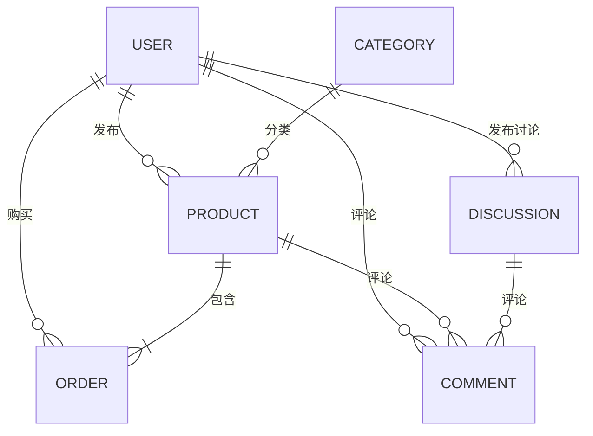

# 校园二手交易平台 - 数据库文档

## 1. 数据库概述

### 1.1 数据库名称

campus_second_hand

### 1.2 数据库版本

MySQL 8.0+

Redis 7.0+

### 1.3 数据库字符集

UTF-8

### 1.4 数据库引擎

InnoDB

### 1.5 数据库用途

存储校园二手交易平台的所有业务数据，包括用户信息、商品信息、订单信息、社区讨论、评论、收藏等。

## 2. 数据库设计原则

1. **遵循三范式**：确保数据的完整性和一致性，减少数据冗余
2. **实体关系清晰**：明确各实体之间的关系，建立合理的外键约束
3. **性能优化**：合理设计索引，优化查询性能
4. **扩展性**：考虑未来业务发展，设计可扩展的数据库结构
5. **安全性**：敏感数据加密存储，设置合理的权限控制

## 3. 数据库实体关系图

### 3.1 Mermaid关系图



### 3.2 实体关系图

实际的实体关系图请参考 `mysql/campus_second_hand.sql` 文件中的表结构定义。

## 4. 详细表结构

### 4.1 用户相关表

#### 4.1.1 users表

| 字段名 | 数据类型 | 约束 | 描述 |
|--------|----------|------|------|
| id | BIGINT | PRIMARY KEY, AUTO_INCREMENT | 用户ID |
| username | VARCHAR(255) | NOT NULL, UNIQUE | 用户名 |
| password | VARCHAR(255) | NOT NULL | 密码（加密存储） |
| email | VARCHAR(255) | NOT NULL, UNIQUE | 邮箱 |
| phone_number | VARCHAR(255) | | 手机号 |
| avatar_url | VARCHAR(255) | | 头像URL |
| real_name | VARCHAR(255) | | 真实姓名 |
| student_id | VARCHAR(255) | | 学号 |
| school_name | VARCHAR(255) | | 学校名称 |
| campus_name | VARCHAR(255) | | 校区名称 |
| role | VARCHAR(255) | DEFAULT 'USER' | 用户角色 |
| is_active | BOOLEAN | DEFAULT TRUE | 是否激活 |
| created_at | TIMESTAMP | DEFAULT CURRENT_TIMESTAMP | 创建时间 |
| updated_at | TIMESTAMP | DEFAULT CURRENT_TIMESTAMP ON UPDATE CURRENT_TIMESTAMP | 更新时间 |

#### 4.1.2 roles表

| 字段名 | 数据类型 | 约束 | 描述 |
|--------|----------|------|------|
| id | BIGINT | PRIMARY KEY, AUTO_INCREMENT | 角色ID |
| name | VARCHAR(255) | NOT NULL, UNIQUE | 角色名称（如ROLE_ADMIN, ROLE_USER） |
| description | VARCHAR(255) | | 角色描述 |

#### 4.1.3 user_roles表（用户角色关联表）

| 字段名 | 数据类型 | 约束 | 描述 |
|--------|----------|------|------|
| user_id | BIGINT | NOT NULL, FOREIGN KEY (user_id) REFERENCES users(id) | 用户ID |
| role_id | BIGINT | NOT NULL, FOREIGN KEY (role_id) REFERENCES roles(id) | 角色ID |
| PRIMARY KEY | | (user_id, role_id) | 联合主键 |

### 4.2 商品相关表

#### 4.2.1 categories表

| 字段名 | 数据类型 | 约束 | 描述 |
|--------|----------|------|------|
| id | BIGINT | PRIMARY KEY, AUTO_INCREMENT | 分类ID |
| name | VARCHAR(255) | NOT NULL | 分类名称 |
| description | TEXT | | 分类描述 |
| icon_url | VARCHAR(255) | | 分类图标URL |
| sort_order | INT | DEFAULT 0 | 排序顺序 |
| is_active | BOOLEAN | DEFAULT TRUE | 是否激活 |
| created_at | TIMESTAMP | DEFAULT CURRENT_TIMESTAMP | 创建时间 |
| updated_at | TIMESTAMP | DEFAULT CURRENT_TIMESTAMP ON UPDATE CURRENT_TIMESTAMP | 更新时间 |

#### 4.2.2 products表

| 字段名 | 数据类型 | 约束 | 描述 |
|--------|----------|------|------|
| id | BIGINT | PRIMARY KEY, AUTO_INCREMENT | 商品ID |
| title | VARCHAR(255) | NOT NULL | 商品标题 |
| description | TEXT | | 商品描述 |
| price | DECIMAL(10,2) | NOT NULL | 商品价格 |
| original_price | DECIMAL(10,2) | | 商品原价 |
| image_urls | TEXT | | 商品图片URL（JSON格式存储多个图片） |
| category_id | BIGINT | NOT NULL, FOREIGN KEY (category_id) REFERENCES categories(id) | 分类ID |
| seller_id | BIGINT | NOT NULL, FOREIGN KEY (seller_id) REFERENCES users(id) | 卖家ID |
| status | VARCHAR(255) | NOT NULL DEFAULT 'AVAILABLE' | 商品状态（AVAILABLE, SOLD, RESERVED, REMOVED） |
| view_count | INT | DEFAULT 0 | 浏览次数 |
| like_count | INT | DEFAULT 0 | 点赞次数 |
| is_negotiable | BOOLEAN | DEFAULT TRUE | 是否可议价 |
| is_new | BOOLEAN | DEFAULT FALSE | 是否全新 |
| delivery_method | VARCHAR(255) | | 配送方式 |
| location | VARCHAR(255) | | 交易地点 |
| contact_info | VARCHAR(255) | | 联系方式 |
| created_at | TIMESTAMP | DEFAULT CURRENT_TIMESTAMP | 创建时间 |
| updated_at | TIMESTAMP | DEFAULT CURRENT_TIMESTAMP ON UPDATE CURRENT_TIMESTAMP | 更新时间 |

### 4.3 订单相关表

#### 4.3.1 orders表

| 字段名 | 数据类型 | 约束 | 描述 |
|--------|----------|------|------|
| id | BIGINT | PRIMARY KEY, AUTO_INCREMENT | 订单ID |
| order_number | VARCHAR(255) | NOT NULL, UNIQUE | 订单编号 |
| product_id | BIGINT | NOT NULL, FOREIGN KEY (product_id) REFERENCES products(id) | 商品ID |
| buyer_id | BIGINT | NOT NULL, FOREIGN KEY (buyer_id) REFERENCES users(id) | 买家ID |
| seller_id | BIGINT | NOT NULL, FOREIGN KEY (seller_id) REFERENCES users(id) | 卖家ID |
| price | DECIMAL(10,2) | NOT NULL | 商品价格 |
| final_price | DECIMAL(10,2) | | 最终成交价 |
| status | VARCHAR(255) | NOT NULL DEFAULT 'PENDING' | 订单状态（PENDING, CONFIRMED, PAID, SHIPPED, COMPLETED, CANCELLED, REFUNDED） |
| contact_info | VARCHAR(255) | | 联系方式 |
| delivery_address | VARCHAR(255) | | 配送地址 |
| delivery_method | VARCHAR(255) | | 配送方式 |
| payment_method | VARCHAR(255) | | 支付方式 |
| payment_status | VARCHAR(255) | DEFAULT 'UNPAID' | 支付状态（UNPAID, PAID, REFUNDED） |
| remarks | TEXT | | 备注 |
| created_at | TIMESTAMP | DEFAULT CURRENT_TIMESTAMP | 创建时间 |
| updated_at | TIMESTAMP | DEFAULT CURRENT_TIMESTAMP ON UPDATE CURRENT_TIMESTAMP | 更新时间 |

#### 4.3.2 cart_items表

| 字段名 | 数据类型 | 约束 | 描述 |
|--------|----------|------|------|
| id | BIGINT | PRIMARY KEY, AUTO_INCREMENT | 购物车项ID |
| user_id | BIGINT | NOT NULL, FOREIGN KEY (user_id) REFERENCES users(id) | 用户ID |
| product_id | BIGINT | NOT NULL, FOREIGN KEY (product_id) REFERENCES products(id) | 商品ID |
| quantity | INT | NOT NULL | 数量 |
| created_at | TIMESTAMP | DEFAULT CURRENT_TIMESTAMP | 创建时间 |
| updated_at | TIMESTAMP | DEFAULT CURRENT_TIMESTAMP ON UPDATE CURRENT_TIMESTAMP | 更新时间 |

### 4.4 社区相关表

#### 4.4.1 discussions表

| 字段名 | 数据类型 | 约束 | 描述 |
|--------|----------|------|------|
| id | BIGINT | PRIMARY KEY, AUTO_INCREMENT | 讨论ID |
| user_id | BIGINT | NOT NULL, FOREIGN KEY (user_id) REFERENCES users(id) | 用户ID |
| title | VARCHAR(255) | NOT NULL | 讨论标题 |
| content | TEXT | NOT NULL | 讨论内容 |
| like_count | INT | DEFAULT 0 | 点赞次数 |
| comment_count | INT | DEFAULT 0 | 评论次数 |
| view_count | INT | DEFAULT 0 | 浏览次数 |
| is_deleted | BOOLEAN | DEFAULT FALSE | 是否删除 |
| created_at | TIMESTAMP | DEFAULT CURRENT_TIMESTAMP | 创建时间 |
| updated_at | TIMESTAMP | DEFAULT CURRENT_TIMESTAMP ON UPDATE CURRENT_TIMESTAMP | 更新时间 |

#### 4.4.2 comments表

| 字段名 | 数据类型 | 约束 | 描述 |
|--------|----------|------|------|
| id | BIGINT | PRIMARY KEY, AUTO_INCREMENT | 评论ID |
| product_id | BIGINT | NULL, FOREIGN KEY (product_id) REFERENCES products(id) | 商品ID（可为空，用于商品评论） |
| discussion_id | BIGINT | NULL, FOREIGN KEY (discussion_id) REFERENCES discussions(id) | 讨论ID（可为空，用于讨论评论） |
| user_id | BIGINT | NOT NULL, FOREIGN KEY (user_id) REFERENCES users(id) | 用户ID |
| content | TEXT | NOT NULL | 评论内容 |
| rating | INT | | 评分（1-5，仅用于商品评论） |
| parent_id | BIGINT | NULL, FOREIGN KEY (parent_id) REFERENCES comments(id) | 父评论ID（用于回复功能） |
| is_deleted | BOOLEAN | DEFAULT FALSE | 是否删除 |
| created_at | TIMESTAMP | DEFAULT CURRENT_TIMESTAMP | 创建时间 |
| updated_at | TIMESTAMP | DEFAULT CURRENT_TIMESTAMP ON UPDATE CURRENT_TIMESTAMP | 更新时间 |

### 4.7 其他表

#### 4.7.1 pickup_points表（取货点表）

| 字段名 | 数据类型 | 约束 | 描述 |
|--------|----------|------|------|
| id | BIGINT | PRIMARY KEY, AUTO_INCREMENT | 取货点ID |
| name | VARCHAR(255) | NOT NULL | 取货点名称 |
| address | VARCHAR(255) | NOT NULL | 取货点地址 |
| contact | VARCHAR(255) | NOT NULL | 联系人 |
| phone | VARCHAR(255) | NOT NULL | 联系电话 |
| is_active | BIT | NOT NULL | 是否激活 |

#### 4.7.2 platform_params表（平台参数表）

| 字段名 | 数据类型 | 约束 | 描述 |
|--------|----------|------|------|
| id | BIGINT | PRIMARY KEY, AUTO_INCREMENT | 参数ID |
| param_key | VARCHAR(255) | NOT NULL, UNIQUE | 参数键 |
| param_value | VARCHAR(255) | NOT NULL | 参数值 |
| description | VARCHAR(255) | | 参数描述 |

#### 4.7.3 announcements表（公告表）

| 字段名 | 数据类型 | 约束 | 描述 |
|--------|----------|------|------|
| id | BIGINT | PRIMARY KEY, AUTO_INCREMENT | 公告ID |
| title | VARCHAR(255) | NOT NULL | 公告标题 |
| content | TEXT | NOT NULL | 公告内容 |
| publisher_id | BIGINT | NOT NULL | 发布者ID |
| is_active | BOOLEAN | DEFAULT TRUE | 是否激活 |
| created_at | TIMESTAMP | DEFAULT CURRENT_TIMESTAMP | 创建时间 |
| updated_at | TIMESTAMP | DEFAULT CURRENT_TIMESTAMP ON UPDATE CURRENT_TIMESTAMP | 更新时间 |

## 5. 数据库索引设计

### 5.1 用户表索引

- PRIMARY KEY: id
- UNIQUE: username, email
- INDEX: is_active, created_at

### 5.2 商品表索引

- PRIMARY KEY: id
- FOREIGN KEY: category_id, seller_id
- INDEX: status, created_at, view_count, like_count
- INDEX: location, category_id

### 5.3 订单表索引

- PRIMARY KEY: id
- UNIQUE: order_number
- FOREIGN KEY: product_id, buyer_id, seller_id
- INDEX: status, created_at, payment_status

### 5.4 讨论表索引

- PRIMARY KEY: id
- FOREIGN KEY: user_id
- INDEX: created_at, like_count, comment_count, view_count

### 5.5 评论表索引

- PRIMARY KEY: id
- FOREIGN KEY: product_id, discussion_id, user_id, parent_id
- INDEX: created_at

## 6. 数据库优化建议

### 6.1 索引优化

1. **添加复合索引**：对于频繁联合查询的字段，如`products`表的`status`和`created_at`，创建复合索引`idx_products_status_created_at`
2. **覆盖索引**：对于常用查询，如商品列表页，创建覆盖索引包含`id`、`title`、`price`、`images`等常用字段，减少回表查询
3. **全文索引**：为商品标题和描述添加全文索引，提高搜索性能
4. **唯一索引**：确保业务唯一性，如用户收藏表的`user_id`和`product_id`组合
5. **合理的索引数量**：避免过度索引，每个表的索引数量建议不超过5个
6. **定期维护索引**：定期分析索引使用情况，删除无用的索引

### 6.2 查询优化

1. **避免SELECT ***：只查询必要字段，减少数据传输量
2. **批量操作**：对于频繁的数据库操作，如批量更新或插入，使用批量操作减少数据库连接次数
3. **慢查询日志**：开启慢查询日志，定期分析并优化慢查询
4. **分页查询优化**：使用`LIMIT`和`OFFSET`进行分页，避免全表扫描
5. **JOIN优化**：减少JOIN操作的数量，优化JOIN条件
6. **避免在WHERE子句中使用函数**：如`DATE(column) = '2023-01-01'`，会导致索引失效

### 6.3 数据管理优化

1. **定期清理无效数据**：定期清理已删除的讨论、评论等无效数据
2. **分表分库**：当数据量增大时，考虑对热门表进行分表分库处理
3. **优化数据类型**：根据实际需求选择合适的数据类型，避免占用过多存储空间
4. **表分区**：对大表进行分区，提高查询性能
5. **数据归档**：将历史数据归档到单独的表或数据库

### 6.4 连接优化

1. **使用连接池**：配置合理的连接池大小，提高连接利用率
2. **减少连接时间**：及时关闭数据库连接，避免连接泄漏
3. **优化事务**：减少事务的范围，避免长事务

### 6.5 使用缓存

对热点数据使用Redis等缓存技术，减少数据库查询压力：

- 商品列表缓存
- 用户信息缓存
- 分类数据缓存
- 配置信息缓存

## 7. 数据安全与备份

1. **数据加密**：敏感数据（如密码）使用加密存储
2. **权限控制**：设置合理的数据库用户权限，遵循最小权限原则
3. **定期备份**：定期对数据库进行全量备份和增量备份
4. **数据恢复测试**：定期进行数据恢复测试，确保备份数据的可用性
5. **防止SQL注入**：使用参数化查询，避免直接拼接SQL语句
6. **防止XSS攻击**：对用户输入进行过滤和转义

## 8. 数据库初始化脚本

数据库初始化脚本位于 `mysql/` 目录下：

- `campus_second_hand.sql` - 完整的数据库表结构和初始数据脚本

后端项目中的初始化脚本位于 `backend/src/main/resources/` 目录下：

- `data.sql` - 数据库表结构初始化脚本
- `import.sql` - 初始数据导入脚本

## 9. Redis数据库使用

### 9.1 Redis配置

| 配置项 | 值 | 说明 |
|--------|-----|------|
| 主机 | localhost | Redis服务器地址 |
| 端口 | 6379 | Redis服务端口 |
| 数据库 | 0 | Redis数据库索引 |
| 连接超时 | 3000ms | 连接Redis的超时时间 |
| 最大活跃连接数 | 8 | 连接池最大活跃连接数 |
| 最大等待时间 | -1ms | 连接池最大等待时间（无限制） |
| 最大空闲连接数 | 8 | 连接池最大空闲连接数 |
| 最小空闲连接数 | 0 | 连接池最小空闲连接数 |

### 9.2 Redis使用场景

| 场景 | 描述 | 实现方式 |
|------|------|----------|
| AI聊天历史记录 | 存储用户与AI助手的聊天记录 | 使用列表结构存储聊天消息列表，设置24小时过期时间 |
| 数据缓存 | 可用于缓存热点数据，如商品列表、用户信息等 | 使用键值对结构，设置适当的过期时间 |
| 会话管理 | 可用于存储用户会话信息 | 使用键值对结构，设置会话过期时间 |

### 9.3 Redis数据结构和键设计

| 数据类型 | 键格式 | 用途 | 过期时间 |
|----------|--------|------|----------|
| List | chat:history:{sessionId} | 存储AI聊天历史记录 | 24小时 |
| String | cache:{key} | 缓存热点数据 | 根据业务需求设置 |
| Hash | session:{sessionId} | 存储用户会话信息 | 会话过期时间 |

### 9.4 Redis使用代码示例

```java
// 存储聊天历史记录
String key = "chat:history:" + sessionId;
List<ChatMessage> chatHistory = getChatHistory(sessionId);
chatHistory.add(userMessage);
redisTemplate.opsForValue().set(key, chatHistory, 24 * 60 * 60, TimeUnit.SECONDS);

// 获取聊天历史记录
String key = "chat:history:" + sessionId;
List<ChatMessage> chatHistory = (List<ChatMessage>) redisTemplate.opsForValue().get(key);

// 清除聊天历史记录
String key = "chat:history:" + sessionId;
redisTemplate.delete(key);
```

### 9.5 Redis性能优化建议

#### 9.5.1 缓存策略优化

1. **缓存雪崩防护**：
   - 设置随机过期时间，避免缓存同时失效
   - 使用多级缓存，如本地缓存+Redis缓存
   - 实现缓存预热，提前加载热点数据
   - 配置Redis持久化，确保数据不会完全丢失

2. **缓存穿透防护**：
   - 使用布隆过滤器过滤无效请求
   - 空值缓存，将不存在的数据也缓存起来，设置较短过期时间
   - 接口层参数校验，过滤无效请求

3. **缓存击穿防护**：
   - 热点数据设置永不过期
   - 使用互斥锁，防止并发请求穿透到数据库
   - 使用Redis SETNX命令实现分布式锁

4. **缓存预热**：
   - 应用启动时预热热点数据
   - 定时任务定期更新热点数据
   - 根据访问频率动态调整缓存内容

#### 9.5.2 数据结构与序列化优化

1. **使用合适的数据结构**：
   - 列表（List）：用于存储聊天记录、最新消息等
   - 哈希表（Hash）：用于存储对象数据，如用户信息、商品信息等
   - 集合（Set）：用于存储唯一数据，如用户标签、商品标签等
   - 有序集合（Sorted Set）：用于排行榜、时间线等场景
   - 地理位置（Geo）：用于附近搜索、位置计算等场景

2. **优化序列化方式**：
   - 使用高效的序列化方式，如Jackson2JsonRedisSerializer
   - 对于简单数据，使用StringRedisSerializer
   - 避免使用Java默认序列化，性能较差

3. **避免大键**：
   - 拆分大型数据结构，如将大型列表拆分为多个小列表
   - 限制单个键的值大小，建议不超过1MB
   - 定期检查和清理大键

#### 9.5.3 操作优化

1. **使用Pipeline**：对于批量操作，使用Pipeline减少网络往返时间
2. **事务与Lua脚本**：
   - 对于原子性操作，使用Redis事务
   - 复杂逻辑使用Lua脚本，减少网络往返和保证原子性
3. **批量命令**：使用mget、mset等批量命令，减少命令数量
4. **合理使用发布订阅**：避免滥用发布订阅功能，影响性能

#### 9.5.4 配置与部署优化

1. **配置合适的连接池**：
   - 根据业务负载配置合适的连接池大小
   - 设置合理的连接超时时间
   - 配置连接池的最大等待时间

2. **内存管理优化**：
   - 配置合适的内存淘汰策略，如LRU、LFU等
   - 设置maxmemory参数，避免内存溢出
   - 定期清理过期数据

3. **高可用性配置**：
   - 主从复制：实现数据冗余和读写分离
   - 哨兵模式：实现自动故障转移
   - 集群模式：实现水平扩展和高可用性

4. **定期监控Redis性能**：
   - 监控内存使用、命中率、响应时间等指标
   - 设置告警阈值，及时发现性能问题
   - 定期分析Redis慢查询日志

5. **网络优化**：
   - 将Redis服务器与应用服务器部署在同一机房
   - 使用高性能网络设备
   - 优化TCP参数，如TCP_NODELAY等

## 10. 前后端性能优化方案

### 10.1 前端性能优化

#### 10.1.1 资源优化

1. **代码分割**：
   - 使用Vue的异步组件和路由懒加载，减少初始加载的JavaScript体积
   - 按功能模块拆分代码，实现按需加载

2. **图片优化**：
   - 图片懒加载：使用`v-lazy`或IntersectionObserver实现图片懒加载
   - 图片压缩：使用工具压缩图片大小，如TinyPNG、ImageOptim等
   - 响应式图片：根据设备尺寸提供不同分辨率的图片
   - WebP格式：使用WebP格式替代JPEG/PNG，减少图片大小
   - CDN加速：使用CDN加速图片访问

3. **CSS优化**：
   - 提取公共CSS，减少重复代码
   - 使用CSS预处理器，如Sass、Less等，提高开发效率
   - 优化CSS选择器，避免复杂选择器
   - 减少CSS动画，使用transform和opacity进行动画

4. **JavaScript优化**：
   - 减少DOM操作，使用虚拟DOM
   - 避免使用全局变量，减少内存泄漏
   - 合理使用闭包，避免过度使用
   - 使用事件委托，减少事件监听器数量

#### 10.1.2 渲染优化

1. **虚拟列表**：
   - 对于长列表（如商品列表），使用虚拟列表只渲染可视区域内的元素
   - 推荐使用vue-virtual-scroller等成熟库

2. **条件渲染**：
   - 使用`v-if`进行条件渲染，只渲染必要的DOM元素
   - 对于频繁切换显示的元素，使用`v-show`

3. **计算属性缓存**：
   - 大量使用Vue的`computed`属性，缓存计算结果，避免重复计算
   - 对于复杂计算，考虑使用`memoize`等缓存函数

4. **减少重绘重排**：
   - 批量操作DOM，避免频繁操作
   - 使用CSS transforms和opacity进行动画
   - 避免在动画中读取布局属性

#### 10.1.3 网络优化

1. **HTTP/2**：
   - 启用HTTP/2，减少连接数和延迟
   - 支持服务器推送，提前发送资源

2. **减少请求数量**：
   - 合并HTTP请求，使用Webpack等工具打包资源
   - 使用CSS Sprites合并小图标
   - 内联关键CSS，减少CSS阻塞

3. **缓存策略**：
   - 合理设置HTTP缓存头，如Cache-Control、ETag等
   - 使用Service Worker实现离线缓存
   - 静态资源使用CDN加速

4. **数据加载优化**：
   - 分页加载：对于大量数据，使用分页加载
   - 无限滚动：实现无限滚动，按需加载数据
   - 预加载：预加载即将访问的资源

### 10.2 后端性能优化

#### 10.2.1 代码优化

1. **优化算法和数据结构**：
   - 选择合适的算法和数据结构，减少时间复杂度
   - 避免嵌套循环和递归，优化复杂逻辑

2. **异步处理**：
   - 对于非核心业务，使用异步处理提高响应速度
   - 使用Spring的@Async注解实现异步方法
   - 使用消息队列处理异步任务，如RabbitMQ、Kafka等

3. **线程池优化**：
   - 配置合理的线程池大小，避免线程过多或过少
   - 监控线程池状态，及时调整配置

4. **减少IO操作**：
   - 批量读写数据库，减少数据库连接次数
   - 使用连接池管理数据库连接
   - 合理使用缓存，减少数据库访问

#### 10.2.2 API优化

1. **RESTful API设计**：
   - 遵循RESTful API设计规范，保持API的简洁和一致性
   - 使用合理的HTTP方法和状态码

2. **API版本控制**：
   - 实现API版本控制，如URL版本控制或Header版本控制
   - 平滑过渡API变更，避免影响现有客户端

3. **参数校验**：
   - 在API层进行参数校验，过滤无效请求
   - 使用Bean Validation等框架进行参数校验

4. **API文档**：
   - 维护完善的API文档，如Swagger、Postman等
   - 定期更新API文档，保持与实际代码一致

#### 10.2.3 监控与分析

1. **性能监控**：
   - 集成APM（应用性能监控）工具，如SkyWalking、Pinpoint、New Relic等
   - 监控API响应时间、吞吐量、错误率等指标
   - 设置告警阈值，及时发现性能问题

2. **日志分析**：
   - 使用ELK等日志分析系统，收集和分析系统日志
   - 实现分布式跟踪，追踪请求的完整调用链路
   - 定期分析日志，发现系统瓶颈和异常

3. **压测与优化**：
   - 使用JMeter等工具进行压力测试，模拟高并发场景
   - 根据压测结果优化系统性能
   - 定期进行压测，验证系统性能

## 11. 注意事项

1. 数据库表结构可能会根据业务需求进行调整，建议使用版本控制管理数据库变更
2. 开发环境和生产环境的数据库配置应分开管理，避免敏感信息泄露
3. 定期监控数据库性能，及时发现和解决性能问题
4. 遵循数据库设计规范，保持数据库结构的清晰和一致性
5. 对于Redis，合理设置过期时间，避免内存占用过高
6. 定期备份Redis数据，尤其是重要的业务数据
7. 考虑Redis的高可用性方案，如主从复制、哨兵模式或集群模式
8. 优化Redis的序列化方式，提高数据存取效率

## 12. 高可用性与故障容灾方案

### 12.1 MySQL高可用性设计

#### 12.1.1 主从复制架构

MySQL主从复制是实现高可用性的基础，通过将主库的二进制日志同步到从库，实现数据冗余和读写分离。

**架构图：**

```
┌─────────────────┐
│    主库 (Master) │
│  (Write Only)   │
└─────────────────┘
        │
        ▼
┌─────────────────┐
│ 从库1 (Slave1)  │
│  (Read Only)    │
└─────────────────┘
        │
        ▼
┌─────────────────┐
│ 从库2 (Slave2)  │
│  (Read Only)    │
└─────────────────┘
```

**配置步骤：**

1. **主库配置（my.cnf）：**

   ```ini
   [mysqld]
   server-id = 1
   log-bin = mysql-bin
   binlog-format = ROW
   ```

2. **从库配置（my.cnf）：**

   ```ini
   [mysqld]
   server-id = 2
   relay-log = mysql-relay-bin
   read-only = 1
   ```

3. **创建复制用户：**

   ```sql
   CREATE USER 'repl'@'%' IDENTIFIED BY 'password';
   GRANT REPLICATION SLAVE ON *.* TO 'repl'@'%';
   FLUSH PRIVILEGES;
   ```

4. **获取主库状态：**

   ```sql
   SHOW MASTER STATUS;
   ```

5. **配置从库连接主库：**

   ```sql
   CHANGE MASTER TO 
       MASTER_HOST='master_ip',
       MASTER_USER='repl',
       MASTER_PASSWORD='password',
       MASTER_LOG_FILE='mysql-bin.000001',
       MASTER_LOG_POS=154;
   
   START SLAVE;
   ```

#### 12.1.2 MySQL MGR (Group Replication) 架构

MySQL Group Replication是MySQL官方提供的高可用解决方案，支持自动故障转移和多主复制。

**架构图：**

```
┌─────────────────┐
│   Node 1 (PRIMARY) │
└─────────────────┘
        │
        ▼
┌─────────────────┐
│   Node 2 (SECONDARY) │
└─────────────────┘
        │
        ▼
┌─────────────────┐
│   Node 3 (SECONDARY) │
└─────────────────┘
```

**配置步骤：**

1. **修改my.cnf配置：**

   ```ini
   [mysqld]
   server-id = 1
   log-bin = mysql-bin
   binlog-format = ROW
   
   # Group Replication配置
   plugin-load = group_replication.so
   group_replication_group_name = "aaaaaaaa-aaaa-aaaa-aaaa-aaaaaaaaaaaa"
   group_replication_start_on_boot = off
   group_replication_local_address = "node1:33061"
   group_replication_group_seeds = "node1:33061,node2:33061,node3:33061"
   group_replication_bootstrap_group = off
   group_replication_single_primary_mode = on
   ```

2. **初始化Group Replication：**

   ```sql
   -- 在第一个节点执行
   SET GLOBAL group_replication_bootstrap_group = ON;
   START GROUP_REPLICATION;
   SET GLOBAL group_replication_bootstrap_group = OFF;
   
   -- 在其他节点执行
   START GROUP_REPLICATION;
   ```

#### 12.1.3 MySQL高可用部署示例（Docker Compose）

```yaml
version: '3.8'

services:
  mysql-master:
    image: mysql:8.0
    container_name: mysql-master
    environment:
      - MYSQL_ROOT_PASSWORD=root_password
      - MYSQL_DATABASE=campus_second_hand
      - MYSQL_USER=repl
      - MYSQL_PASSWORD=repl_password
    volumes:
      - ./mysql/master/my.cnf:/etc/mysql/conf.d/my.cnf
      - mysql-master-data:/var/lib/mysql
    ports:
      - "3306:3306"
    networks:
      - campus-network

  mysql-slave1:
    image: mysql:8.0
    container_name: mysql-slave1
    environment:
      - MYSQL_ROOT_PASSWORD=root_password
      - MYSQL_DATABASE=campus_second_hand
    volumes:
      - ./mysql/slave1/my.cnf:/etc/mysql/conf.d/my.cnf
      - mysql-slave1-data:/var/lib/mysql
    ports:
      - "3307:3306"
    networks:
      - campus-network
    depends_on:
      - mysql-master

  mysql-slave2:
    image: mysql:8.0
    container_name: mysql-slave2
    environment:
      - MYSQL_ROOT_PASSWORD=root_password
      - MYSQL_DATABASE=campus_second_hand
    volumes:
      - ./mysql/slave2/my.cnf:/etc/mysql/conf.d/my.cnf
      - mysql-slave2-data:/var/lib/mysql
    ports:
      - "3308:3306"
    networks:
      - campus-network
    depends_on:
      - mysql-master

volumes:
  mysql-master-data:
  mysql-slave1-data:
  mysql-slave2-data:

networks:
  campus-network:
    driver: bridge
```

### 12.2 Redis高可用性设计

#### 12.2.1 Redis主从复制 + 哨兵模式

Redis哨兵模式是实现Redis高可用的经典方案，通过哨兵节点监控主从节点状态，实现自动故障转移。

**架构图：**

```
┌─────────────────┐
│  Sentinel 1     │
└─────────────────┘
        │
        ▼
┌─────────────────┐
│  Sentinel 2     │
└─────────────────┘
        │
        ▼
┌─────────────────┐
│  Sentinel 3     │
└─────────────────┘
        │
        ▼
┌─────────────────┐
│    Master       │
└─────────────────┘
        │
        ▼
┌─────────────────┐
│    Slave 1      │
└─────────────────┘
        │
        ▼
┌─────────────────┐
│    Slave 2      │
└─────────────────┘
```

**配置步骤：**

1. **Redis主从配置：**
   - 主库无需特殊配置
   - 从库配置文件添加：`slaveof master_ip 6379`

2. **哨兵配置（sentinel.conf）：**

   ```conf
   sentinel monitor mymaster 127.0.0.1 6379 2
   sentinel down-after-milliseconds mymaster 30000
   sentinel failover-timeout mymaster 180000
   sentinel parallel-syncs mymaster 1
   ```

3. **启动命令：**

   ```bash
   # 启动主从节点
   redis-server redis.conf
   
   # 启动哨兵节点
   redis-sentinel sentinel.conf
   ```

#### 12.2.2 Redis Cluster 架构

Redis Cluster是Redis官方提供的分布式解决方案，支持自动分片和高可用性。

**架构图：**

```
┌─────────────────┐  ┌─────────────────┐
│  Master 1       │  │  Slave 1        │
└─────────────────┘  └─────────────────┘
        │                    │
        ▼                    ▼
┌─────────────────┐  ┌─────────────────┐
│  Master 2       │  │  Slave 2        │
└─────────────────┘  └─────────────────┘
        │                    │
        ▼                    ▼
┌─────────────────┐  ┌─────────────────┐
│  Master 3       │  │  Slave 3        │
└─────────────────┘  └─────────────────┘
```

**配置步骤：**

1. **Redis配置文件：**

   ```conf
   port 7000
   cluster-enabled yes
   cluster-config-file nodes.conf
   cluster-node-timeout 5000
   appendonly yes
   ```

2. **启动Redis节点：**

   ```bash
   redis-server redis-7000.conf
   redis-server redis-7001.conf
   redis-server redis-7002.conf
   redis-server redis-7003.conf
   redis-server redis-7004.conf
   redis-server redis-7005.conf
   ```

3. **创建集群：**

   ```bash
   redis-cli --cluster create 127.0.0.1:7000 127.0.0.1:7001 127.0.0.1:7002 127.0.0.1:7003 127.0.0.1:7004 127.0.0.1:7005 --cluster-replicas 1
   ```

#### 12.2.3 Redis高可用部署示例（Docker Compose）

```yaml
version: '3.8'

services:
  redis-master:
    image: redis:7.0
    container_name: redis-master
    command: redis-server --requirepass redis_password
    volumes:
      - redis-master-data:/data
    ports:
      - "6379:6379"
    networks:
      - campus-network

  redis-slave1:
    image: redis:7.0
    container_name: redis-slave1
    command: redis-server --slaveof redis-master 6379 --requirepass redis_password --masterauth redis_password
    volumes:
      - redis-slave1-data:/data
    ports:
      - "6380:6379"
    networks:
      - campus-network
    depends_on:
      - redis-master

  redis-slave2:
    image: redis:7.0
    container_name: redis-slave2
    command: redis-server --slaveof redis-master 6379 --requirepass redis_password --masterauth redis_password
    volumes:
      - redis-slave2-data:/data
    ports:
      - "6381:6379"
    networks:
      - campus-network
    depends_on:
      - redis-master

  redis-sentinel1:
    image: redis:7.0
    container_name: redis-sentinel1
    command: redis-sentinel /usr/local/etc/redis/sentinel.conf
    volumes:
      - ./redis/sentinel1.conf:/usr/local/etc/redis/sentinel.conf
    ports:
      - "26379:26379"
    networks:
      - campus-network
    depends_on:
      - redis-master
      - redis-slave1
      - redis-slave2

  redis-sentinel2:
    image: redis:7.0
    container_name: redis-sentinel2
    command: redis-sentinel /usr/local/etc/redis/sentinel.conf
    volumes:
      - ./redis/sentinel2.conf:/usr/local/etc/redis/sentinel.conf
    ports:
      - "26380:26379"
    networks:
      - campus-network
    depends_on:
      - redis-master
      - redis-slave1
      - redis-slave2

  redis-sentinel3:
    image: redis:7.0
    container_name: redis-sentinel3
    command: redis-sentinel /usr/local/etc/redis/sentinel.conf
    volumes:
      - ./redis/sentinel3.conf:/usr/local/etc/redis/sentinel.conf
    ports:
      - "26381:26379"
    networks:
      - campus-network
    depends_on:
      - redis-master
      - redis-slave1
      - redis-slave2

volumes:
  redis-master-data:
  redis-slave1-data:
  redis-slave2-data:

networks:
  campus-network:
    driver: bridge
```

### 12.3 故障容灾设计

#### 12.3.1 数据备份策略

1. **MySQL备份：**
   - 全量备份：使用`mysqldump`或`xtrabackup`进行每日全量备份
   - 增量备份：使用二进制日志进行增量备份
   - 备份存储：备份文件存储在异地服务器或云存储中

2. **Redis备份：**
   - RDB快照：配置定期RDB快照，如每小时一次
   - AOF日志：启用AOF持久化，确保数据不丢失
   - 备份存储：定期将RDB和AOF文件复制到异地存储

#### 12.3.2 故障恢复流程

1. **MySQL故障恢复：**
   - 主库故障：使用从库提升为主库，或使用MGR自动故障转移
   - 数据丢失：从备份恢复数据，然后同步从库

2. **Redis故障恢复：**
   - 主库故障：使用哨兵自动故障转移，或Cluster自动重新分片
   - 数据丢失：从RDB或AOF文件恢复数据

#### 12.3.3 监控与告警

1. **监控指标：**
   - MySQL：连接数、查询频率、慢查询、主从延迟等
   - Redis：内存使用、命中率、连接数、主从延迟等

2. **告警机制：**
   - 使用Prometheus + Grafana进行监控
   - 配置Alertmanager进行告警
   - 告警方式：邮件、短信、微信等

### 12.4 完整系统部署示例（Docker Compose）

**完整的校园二手交易平台部署示例，包括MySQL主从复制、Redis哨兵模式、后端服务和前端服务：**

```yaml
version: '3.8'

services:
  # MySQL主从复制
  mysql-master:
    image: mysql:8.0
    container_name: mysql-master
    environment:
      - MYSQL_ROOT_PASSWORD=root_password
      - MYSQL_DATABASE=campus_second_hand
      - MYSQL_USER=repl
      - MYSQL_PASSWORD=repl_password
    volumes:
      - ./mysql/master/my.cnf:/etc/mysql/conf.d/my.cnf
      - mysql-master-data:/var/lib/mysql
      - ./mysql/init.sql:/docker-entrypoint-initdb.d/init.sql
    networks:
      - campus-network

  mysql-slave1:
    image: mysql:8.0
    container_name: mysql-slave1
    environment:
      - MYSQL_ROOT_PASSWORD=root_password
      - MYSQL_DATABASE=campus_second_hand
    volumes:
      - ./mysql/slave1/my.cnf:/etc/mysql/conf.d/my.cnf
      - mysql-slave1-data:/var/lib/mysql
    networks:
      - campus-network
    depends_on:
      - mysql-master

  # Redis哨兵模式
  redis-master:
    image: redis:7.0
    container_name: redis-master
    command: redis-server --requirepass redis_password
    volumes:
      - redis-master-data:/data
    networks:
      - campus-network

  redis-slave1:
    image: redis:7.0
    container_name: redis-slave1
    command: redis-server --slaveof redis-master 6379 --requirepass redis_password --masterauth redis_password
    volumes:
      - redis-slave1-data:/data
    networks:
      - campus-network
    depends_on:
      - redis-master

  redis-sentinel1:
    image: redis:7.0
    container_name: redis-sentinel1
    command: redis-sentinel /usr/local/etc/redis/sentinel.conf
    volumes:
      - ./redis/sentinel1.conf:/usr/local/etc/redis/sentinel.conf
    networks:
      - campus-network
    depends_on:
      - redis-master
      - redis-slave1

  # 后端服务
  backend:
    image: campus-secondhand-backend:latest
    container_name: campus-backend
    environment:
      - SPRING_DATASOURCE_URL=jdbc:mysql://mysql-master:3306/campus_second_hand?useUnicode=true&characterEncoding=utf-8&useSSL=false&serverTimezone=Asia/Shanghai
      - SPRING_DATASOURCE_USERNAME=root
      - SPRING_DATASOURCE_PASSWORD=root_password
      - SPRING_REDIS_HOST=redis-sentinel1
      - SPRING_REDIS_PORT=26379
      - SPRING_REDIS_PASSWORD=redis_password
      - SPRING_REDIS_SENTINEL_MASTER=mymaster
    ports:
      - "8081:8081"
    networks:
      - campus-network
    depends_on:
      - mysql-master
      - mysql-slave1
      - redis-sentinel1

  # 前端服务
  frontend:
    image: campus-secondhand-frontend:latest
    container_name: campus-frontend
    ports:
      - "3000:80"
    networks:
      - campus-network
    depends_on:
      - backend

volumes:
  mysql-master-data:
  mysql-slave1-data:
  redis-master-data:
  redis-slave1-data:

networks:
  campus-network:
    driver: bridge
```

## 13. 高并发高负载扩展方案

### 13.1 数据库扩展方案

#### 13.1.1 读写分离

读写分离是提高数据库并发能力的基础方案，通过将读操作分散到从库，减轻主库压力。

**架构图：**

```
┌─────────────────┐
│    主库 (Master) │
│  (Write Only)   │
└─────────────────┘
        │
        ▼
┌─────────────────┐
│ 从库1 (Slave1)  │
│  (Read Only)    │
└─────────────────┘
        │
        ▼
┌─────────────────┐
│ 从库2 (Slave2)  │
│  (Read Only)    │
└─────────────────┘
        │
        ▼
┌─────────────────┐
│ 负载均衡器      │
└─────────────────┘
        │
        ▼
┌─────────────────┐
│ 应用服务器集群  │
└─────────────────┘
```

**实现方式：**

- 使用MySQL主从复制搭建读写分离集群
- 应用层通过中间件（如ShardingSphere、MyCAT）实现读写分离路由
- 或者在代码中实现读写分离逻辑

**读写分离配置示例（ShardingSphere）：**

```yaml
spring:
  shardingsphere:
    datasource:
      names: master,slave1,slave2
      master:
        # 主库配置
      slave1:
        # 从库1配置
      slave2:
        # 从库2配置
    rules:
      readwrite-splitting:
        data-sources:
          pr_ds:
            write-data-source-name: master
            read-data-source-names: slave1,slave2
            load-balancer-name: round-robin
        load-balancers:
          round-robin:
            type: ROUND_ROBIN
```

#### 13.1.2 分库分表

当数据量增大到一定程度时，需要进行分库分表，将数据分散到多个数据库和表中。

**分库分表策略：**

- **垂直分库**：根据业务模块将表分散到不同的数据库
- **垂直分表**：将大表按列拆分到多个表
- **水平分库**：将相同表结构的数据分散到不同的数据库
- **水平分表**：将相同表结构的数据按行拆分到多个表

**分库分表键选择：**

- 用户表：按user_id分库分表
- 商品表：按product_id分库分表
- 订单表：按order_id或create_time分库分表

**分库分表配置示例（ShardingSphere）：**

```yaml
spring:
  shardingsphere:
    rules:
      sharding:
        tables:
          t_order:
            actual-data-nodes: ds${0..1}.t_order${0..1}
            table-strategy:
              standard:
                sharding-column: order_id
                sharding-algorithm-name: t_order_inline
            database-strategy:
              standard:
                sharding-column: user_id
                sharding-algorithm-name: database_inline
        sharding-algorithms:
          database_inline:
            type: INLINE
            props:
              algorithm-expression: ds${user_id % 2}
          t_order_inline:
            type: INLINE
            props:
              algorithm-expression: t_order${order_id % 2}
```

#### 13.1.3 数据库集群

使用数据库集群技术提高数据库的并发处理能力和可用性。

**主流数据库集群方案：**

- MySQL Cluster：MySQL官方分布式集群方案
- Percona XtraDB Cluster：基于Galera Cluster的MySQL集群
- TiDB：分布式NewSQL数据库，支持自动分片和水平扩展

**TiDB集群架构：**

```
┌─────────────────┐
│  TiDB 节点      │  # SQL层，处理客户端请求
└─────────────────┘
        │
        ▼
┌─────────────────┐
│  PD 节点        │  # 集群管理，元数据存储
└─────────────────┘
        │
        ▼
┌─────────────────┐
│  TiKV 节点      │  # 存储层，分布式KV存储
└─────────────────┘
```

### 13.2 Redis扩展方案

#### 13.2.1 Redis Cluster

Redis Cluster是Redis官方提供的分布式解决方案，支持自动分片和高可用性。

**Redis Cluster架构：**

```
┌─────────────────┐  ┌─────────────────┐
│  Master 1       │  │  Slave 1        │
│  (Slots 0-5460) │  │  (Replica)      │
└─────────────────┘  └─────────────────┘
        │                    │
        ▼                    ▼
┌─────────────────┐  ┌─────────────────┐
│  Master 2       │  │  Slave 2        │
│  (Slots 5461-10922) │  (Replica)      │
└─────────────────┘  └─────────────────┘
        │                    │
        ▼                    ▼
┌─────────────────┐  ┌─────────────────┐
│  Master 3       │  │  Slave 3        │
│  (Slots 10923-16383) │  (Replica)      │
└─────────────────┘  └─────────────────┘
```

**Redis Cluster配置示例：**

```conf
port 7000
cluster-enabled yes
cluster-config-file nodes.conf
cluster-node-timeout 5000
appendonly yes
cluster-require-full-coverage no
```

**启动Redis Cluster：**

```bash
# 启动6个Redis节点（3主3从）
redis-server redis-7000.conf
redis-server redis-7001.conf
redis-server redis-7002.conf
redis-server redis-7003.conf
redis-server redis-7004.conf
redis-server redis-7005.conf

# 创建集群
redis-cli --cluster create 127.0.0.1:7000 127.0.0.1:7001 127.0.0.1:7002 127.0.0.1:7003 127.0.0.1:7004 127.0.0.1:7005 --cluster-replicas 1
```

#### 13.2.2 Redis主从复制 + 哨兵模式

对于中小规模的应用，Redis主从复制 + 哨兵模式是一个简单有效的扩展方案。

**架构图：**

```
┌─────────────────┐
│  Sentinel 1     │
└─────────────────┘
        │
        ▼
┌─────────────────┐
│  Sentinel 2     │
└─────────────────┘
        │
        ▼
┌─────────────────┐
│  Sentinel 3     │
└─────────────────┘
        │
        ▼
┌─────────────────┐
│    Master       │
└─────────────────┘
        │
        ▼
┌─────────────────┐
│    Slave 1      │
└─────────────────┘
        │
        ▼
┌─────────────────┐
│    Slave 2      │
└─────────────────┘
```

### 13.3 应用层扩展方案

#### 13.3.1 负载均衡

负载均衡是提高应用并发能力的基础方案，通过将请求分散到多个应用服务器，提高系统整体处理能力。

**常用负载均衡器：**

- Nginx：轻量级HTTP和反向代理服务器
- HAProxy：高性能TCP/HTTP负载均衡器
- F5：硬件负载均衡器

**Nginx负载均衡配置示例：**

```nginx
http {
    upstream campus-backend {
        server 127.0.0.1:8081;
        server 127.0.0.1:8082;
        server 127.0.0.1:8083;
    }
    
    server {
        listen 80;
        server_name localhost;
        
        location / {
            proxy_pass http://campus-backend;
            proxy_set_header Host $host;
            proxy_set_header X-Real-IP $remote_addr;
            proxy_set_header X-Forwarded-For $proxy_add_x_forwarded_for;
        }
    }
}
```

#### 13.3.2 微服务架构

将单体应用拆分为多个微服务，每个微服务独立部署和扩展，提高系统的可扩展性和容错能力。

**微服务架构图：**

```
┌─────────────────┐
│  API Gateway    │
└─────────────────┘
        │
        ▼
┌─────────────────┐  ┌─────────────────┐  ┌─────────────────┐
│  用户服务       │  │  商品服务       │  │  订单服务       │
└─────────────────┘  └─────────────────┘  └─────────────────┘
        │                    │                    │
        ▼                    ▼                    ▼
┌─────────────────┐  ┌─────────────────┐  ┌─────────────────┐
│  用户数据库     │  │  商品数据库     │  │  订单数据库     │
└─────────────────┘  └─────────────────┘  └─────────────────┘
```

#### 13.3.3 缓存优化

缓存是提高系统并发能力的关键，通过缓存热点数据，减少数据库访问压力。

**缓存策略：**

- **多级缓存**：本地缓存 + 分布式缓存
- **缓存预热**：应用启动时加载热点数据
- **缓存过期策略**：合理设置缓存过期时间，避免缓存雪崩
- **缓存更新策略**：双写一致性、异步更新等

### 13.4 高并发高负载部署示例

#### 13.4.1 Docker Compose部署示例

**适合中小规模应用的高并发部署方案：**

```yaml
version: '3.8'

services:
  # 负载均衡器
  nginx:
    image: nginx:latest
    container_name: nginx
    ports:
      - "80:80"
    volumes:
      - ./nginx/nginx.conf:/etc/nginx/nginx.conf
    networks:
      - campus-network
    depends_on:
      - backend1
      - backend2
      - backend3

  # MySQL主从复制
  mysql-master:
    image: mysql:8.0
    container_name: mysql-master
    environment:
      - MYSQL_ROOT_PASSWORD=root_password
      - MYSQL_DATABASE=campus_second_hand
      - MYSQL_USER=repl
      - MYSQL_PASSWORD=repl_password
    volumes:
      - ./mysql/master/my.cnf:/etc/mysql/conf.d/my.cnf
      - mysql-master-data:/var/lib/mysql
    networks:
      - campus-network

  mysql-slave1:
    image: mysql:8.0
    container_name: mysql-slave1
    environment:
      - MYSQL_ROOT_PASSWORD=root_password
      - MYSQL_DATABASE=campus_second_hand
    volumes:
      - ./mysql/slave1/my.cnf:/etc/mysql/conf.d/my.cnf
      - mysql-slave1-data:/var/lib/mysql
    networks:
      - campus-network
    depends_on:
      - mysql-master

  mysql-slave2:
    image: mysql:8.0
    container_name: mysql-slave2
    environment:
      - MYSQL_ROOT_PASSWORD=root_password
      - MYSQL_DATABASE=campus_second_hand
    volumes:
      - ./mysql/slave2/my.cnf:/etc/mysql/conf.d/my.cnf
      - mysql-slave2-data:/var/lib/mysql
    networks:
      - campus-network
    depends_on:
      - mysql-master

  # Redis Cluster
  redis1:
    image: redis:7.0
    container_name: redis1
    command: redis-server /usr/local/etc/redis/redis.conf
    volumes:
      - ./redis/redis1.conf:/usr/local/etc/redis/redis.conf
      - redis1-data:/data
    ports:
      - "7000:7000"
      - "17000:17000"
    networks:
      - campus-network

  redis2:
    image: redis:7.0
    container_name: redis2
    command: redis-server /usr/local/etc/redis/redis.conf
    volumes:
      - ./redis/redis2.conf:/usr/local/etc/redis/redis.conf
      - redis2-data:/data
    ports:
      - "7001:7001"
      - "17001:17001"
    networks:
      - campus-network

  redis3:
    image: redis:7.0
    container_name: redis3
    command: redis-server /usr/local/etc/redis/redis.conf
    volumes:
      - ./redis/redis3.conf:/usr/local/etc/redis/redis.conf
      - redis3-data:/data
    ports:
      - "7002:7002"
      - "17002:17002"
    networks:
      - campus-network

  # 后端服务集群
  backend1:
    image: campus-secondhand-backend:latest
    container_name: backend1
    environment:
      - SPRING_DATASOURCE_URL=jdbc:mysql://mysql-master:3306/campus_second_hand?useUnicode=true&characterEncoding=utf-8&useSSL=false&serverTimezone=Asia/Shanghai
      - SPRING_DATASOURCE_USERNAME=root
      - SPRING_DATASOURCE_PASSWORD=root_password
      - SPRING_REDIS_CLUSTER_NODES=redis1:7000,redis2:7001,redis3:7002
      - SPRING_REDIS_PASSWORD=redis_password
    ports:
      - "8081:8081"
    networks:
      - campus-network
    depends_on:
      - mysql-master
      - mysql-slave1
      - mysql-slave2
      - redis1
      - redis2
      - redis3

  backend2:
    image: campus-secondhand-backend:latest
    container_name: backend2
    environment:
      - SPRING_DATASOURCE_URL=jdbc:mysql://mysql-master:3306/campus_second_hand?useUnicode=true&characterEncoding=utf-8&useSSL=false&serverTimezone=Asia/Shanghai
      - SPRING_DATASOURCE_USERNAME=root
      - SPRING_DATASOURCE_PASSWORD=root_password
      - SPRING_REDIS_CLUSTER_NODES=redis1:7000,redis2:7001,redis3:7002
      - SPRING_REDIS_PASSWORD=redis_password
    ports:
      - "8082:8081"
    networks:
      - campus-network
    depends_on:
      - mysql-master
      - mysql-slave1
      - mysql-slave2
      - redis1
      - redis2
      - redis3

  backend3:
    image: campus-secondhand-backend:latest
    container_name: backend3
    environment:
      - SPRING_DATASOURCE_URL=jdbc:mysql://mysql-master:3306/campus_second_hand?useUnicode=true&characterEncoding=utf-8&useSSL=false&serverTimezone=Asia/Shanghai
      - SPRING_DATASOURCE_USERNAME=root
      - SPRING_DATASOURCE_PASSWORD=root_password
      - SPRING_REDIS_CLUSTER_NODES=redis1:7000,redis2:7001,redis3:7002
      - SPRING_REDIS_PASSWORD=redis_password
    ports:
      - "8083:8081"
    networks:
      - campus-network
    depends_on:
      - mysql-master
      - mysql-slave1
      - mysql-slave2
      - redis1
      - redis2
      - redis3

  # 前端服务
  frontend:
    image: campus-secondhand-frontend:latest
    container_name: frontend
    ports:
      - "3000:80"
    networks:
      - campus-network
    depends_on:
      - nginx

volumes:
  mysql-master-data:
  mysql-slave1-data:
  mysql-slave2-data:
  redis1-data:
  redis2-data:
  redis3-data:

networks:
  campus-network:
    driver: bridge
```

#### 13.4.2 Kubernetes部署示例

**适合大规模应用的高并发部署方案：**

```yaml
# MySQL主从复制部署
aapiVersion: apps/v1
kind: Deployment
metadata:
  name: mysql-master
spec:
  replicas: 1
  selector:
    matchLabels:
      app: mysql
      role: master
  template:
    metadata:
      labels:
        app: mysql
        role: master
    spec:
      containers:
      - name: mysql-master
        image: mysql:8.0
        env:
        - name: MYSQL_ROOT_PASSWORD
          value: "root_password"
        - name: MYSQL_DATABASE
          value: "campus_second_hand"
        ports:
        - containerPort: 3306
        volumeMounts:
        - name: mysql-master-config
          mountPath: /etc/mysql/conf.d/
        - name: mysql-master-data
          mountPath: /var/lib/mysql
      volumes:
      - name: mysql-master-config
        configMap:
          name: mysql-master-config
      - name: mysql-master-data
        persistentVolumeClaim:
          claimName: mysql-master-pvc
---
# Redis Cluster部署
apiVersion: apps/v1
kind: StatefulSet
metadata:
  name: redis-cluster
spec:
  serviceName: redis-cluster
  replicas: 6
  selector:
    matchLabels:
      app: redis-cluster
  template:
    metadata:
      labels:
        app: redis-cluster
    spec:
      containers:
      - name: redis-cluster
        image: redis:7.0
        command:
        - redis-server
        - /usr/local/etc/redis/redis.conf
        ports:
        - containerPort: 6379
          name: client
        - containerPort: 16379
          name: gossip
        volumeMounts:
        - name: redis-config
          mountPath: /usr/local/etc/redis/
        - name: redis-data
          mountPath: /data
      volumes:
      - name: redis-config
        configMap:
          name: redis-cluster-config
  volumeClaimTemplates:
  - metadata:
      name: redis-data
    spec:
      accessModes: ["ReadWriteOnce"]
      resources:
        requests:
          storage: 1Gi
---
# 后端服务部署
apiVersion: apps/v1
kind: Deployment
metadata:
  name: backend
spec:
  replicas: 3
  selector:
    matchLabels:
      app: backend
  template:
    metadata:
      labels:
        app: backend
    spec:
      containers:
      - name: backend
        image: campus-secondhand-backend:latest
        env:
        - name: SPRING_DATASOURCE_URL
          value: "jdbc:mysql://mysql-master:3306/campus_second_hand?useUnicode=true&characterEncoding=utf-8&useSSL=false&serverTimezone=Asia/Shanghai"
        - name: SPRING_DATASOURCE_USERNAME
          value: "root"
        - name: SPRING_DATASOURCE_PASSWORD
          value: "root_password"
        - name: SPRING_REDIS_CLUSTER_NODES
          value: "redis-cluster-0.redis-cluster:6379,redis-cluster-1.redis-cluster:6379,redis-cluster-2.redis-cluster:6379"
        ports:
        - containerPort: 8081
---
# 负载均衡服务
apiVersion: v1
kind: Service
metadata:
  name: backend-service
spec:
  selector:
    app: backend
  ports:
  - port: 80
    targetPort: 8081
  type: LoadBalancer
```

### 13.5 扩展方案选择建议

| 业务规模 | 推荐方案 |
|----------|----------|
| 初创期 | 单实例MySQL + Redis主从复制 + 单应用服务器 |
| 成长期 | MySQL主从复制（读写分离） + Redis Cluster + 应用服务器集群 + 负载均衡 |
| 成熟期 | 分库分表 + Redis Cluster + 微服务架构 + Kubernetes集群 |
| 大规模 | 分布式数据库（如TiDB） + Redis Cluster + 微服务架构 + Kubernetes集群 + CDN加速 |

## 14. Redis后续完善方向

### 14.1 缓存热点数据

- **商品列表缓存**：缓存热门商品列表，减少数据库查询压力
- **用户信息缓存**：缓存活跃用户的基本信息，提高系统响应速度
- **分类数据缓存**：缓存商品分类数据，减少数据库查询
- **配置信息缓存**：缓存平台配置信息，支持动态更新

### 14.2 会话管理

- **用户会话存储**：使用Redis存储用户会话信息，替代传统的会话存储
- **单点登录支持**：基于Redis实现分布式系统的单点登录
- **会话共享**：支持多实例部署时的会话共享

### 14.3 分布式锁和并发控制

- **商品秒杀**：使用Redis实现分布式锁，处理商品秒杀场景
- **库存扣减**：使用Redis实现原子性的库存扣减操作
- **并发请求控制**：限制同一用户的并发请求数量

### 14.4 计数器和统计

- **访问量统计**：使用Redis计数器统计商品访问量
- **点赞数统计**：实时统计商品和讨论的点赞数
- **评论数统计**：实时统计商品和讨论的评论数
- **在线用户统计**：统计当前在线用户数量

### 14.5 消息队列和异步处理

- **异步任务处理**：使用Redis的List或Stream结构实现简单的消息队列
- **邮件发送**：异步发送邮件通知
- **日志处理**：异步处理系统日志
- **数据同步**：实现不同系统间的数据同步

### 14.6 地理位置服务

- **附近商品搜索**：使用Redis的GeoHash功能实现附近商品搜索
- **校园内定位**：支持校园内的地理位置服务
- **活动范围限制**：基于地理位置限制某些功能的使用范围

### 14.7 数据安全和优化

- **布隆过滤器**：使用布隆过滤器防止缓存穿透
- **缓存预热**：系统启动时预加载热点数据到Redis
- **缓存更新策略**：实现合适的缓存更新策略，如过期时间、主动更新等
- **数据分片**：使用Redis Cluster实现大规模数据存储

### 14.8 高可用性和可靠性

- **主从复制**：配置Redis主从复制，提高数据可靠性
- **哨兵模式**：使用Redis Sentinel实现自动故障转移
- **Redis Cluster**：部署Redis Cluster，实现高可用和水平扩展
- **定期备份**：实现Redis数据的定期备份和恢复机制

### 14.9 监控和告警

- **性能监控**：建立Redis性能监控体系，监控内存使用、命中率、响应时间等指标
- **异常告警**：设置Redis异常告警，如内存使用率过高、连接数过多等
- **慢查询分析**：定期分析Redis慢查询日志，优化查询性能

### 14.10 开发工具和规范

- **Redis客户端封装**：封装Redis客户端，提供统一的访问接口
- **Redis键命名规范**：制定统一的Redis键命名规范
- **Redis使用文档**：完善Redis使用文档，规范开发人员使用
- **Redis测试**：添加Redis相关的单元测试和集成测试

通过以上方向的完善，可以充分发挥Redis的优势，提高系统的性能、可靠性和扩展性，为校园二手交易平台的发展提供有力支持。
